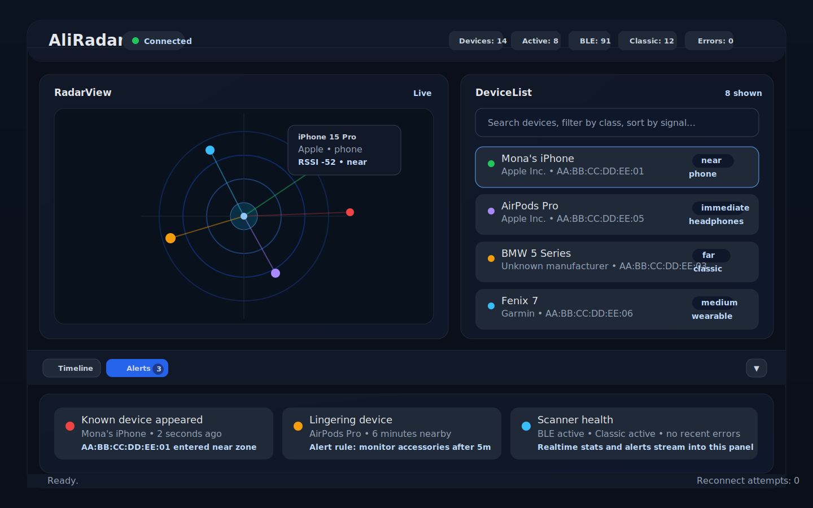

# AliRadar

AliRadar is a Windows-first desktop Bluetooth radar that continuously scans for nearby Bluetooth Low Energy (BLE) and Classic Bluetooth devices, stores sightings in SQLite, and presents the results in a live React + Electron dashboard powered by a FastAPI backend.

The project is designed for a USB Bluetooth dongle connected to a Windows 10/11 machine. It discovers nearby devices such as phones, laptops, headphones, speakers, wearables, cars, and tags, then enriches those sightings with manufacturer, device class, estimated distance, live updates, and alert events.

## Preview

> This is a simulated preview based on the current React/Electron layout and styles in the repository, not an actual runtime screenshot.



## What the project includes

- **Bluetooth scanning pipeline** for BLE and Classic Bluetooth discovery, normalization, deduplication, enrichment, presence tracking, and alert evaluation.
- **FastAPI backend** with REST endpoints, WebSocket broadcasting, Alembic migrations, and SQLite persistence.
- **React + Vite frontend** embedded in Electron for a desktop-style user experience with device, alert, and status views.
- **Windows packaging path** using PyInstaller for the backend and Electron Builder for the desktop app installer.

## Repository structure

```text
AliRadar/
├── backend/                 # FastAPI app, scanners, pipeline, DB, tests
├── frontend/                # React UI + Electron shell
├── data/                    # IEEE OUI vendor data
├── scripts/                 # Utility scripts such as OUI downloader
├── context.md               # Deep project context / architecture notes
├── PLAN.md                  # Build and implementation plan history
└── README.md                # Project documentation
```

### Important folders

#### `backend/`
- `api/`: REST and WebSocket server setup, route definitions, broadcast manager.
- `scanner/`: BLE scanner, Classic Bluetooth scanner, orchestration manager.
- `pipeline/`: raw-event normalization, deduplication, and enrichment wiring.
- `intelligence/`: OUI lookup, distance estimation, presence tracking, and alerts logic.
- `storage/`: SQLAlchemy models, DB initialization, and query layer.
- `tests/`: API and end-to-end pipeline tests.

#### `frontend/`
- `src/`: React application, stores, hooks, and presentational components.
- `electron/`: Electron main/preload entry points for desktop packaging.
- `package.json`: UI dependencies and desktop build scripts.

## How AliRadar works

1. **Scanners capture nearby Bluetooth traffic**:
   - BLE events are received via `bleak.BleakScanner` in passive scanning mode.
   - Classic Bluetooth discovery is executed with `pybluez2` inquiries in an executor so it does not block the asyncio loop.
2. **The pipeline cleans and enriches each event**:
   - invalid MAC addresses and too-weak RSSI values are discarded.
   - similar sightings can be deduplicated into a canonical MAC when fingerprint data matches.
   - manufacturer, device class, and estimated distance are added before persistence/broadcasting.
3. **The scanner manager persists and broadcasts results**:
   - device metadata is upserted,
   - sightings are throttled to reduce redundant writes,
   - WebSocket clients receive live device updates,
   - alert rules are evaluated per event.
4. **The desktop UI consumes REST + WebSocket data**:
   - initial data loads come from the REST API,
   - live updates and alert events come over WebSocket,
   - the app renders connection state, device counts, and alerts in the Electron window.

## Core features

- Continuous BLE scanning with passive advertisements.
- Classic Bluetooth discovery support with graceful fallback if `pybluez2` is unavailable.
- SQLite storage for devices, sightings, alert rules, and alert events.
- REST endpoints for devices, sightings, alert rules/events, and scanner stats.
- WebSocket broadcasting for real-time UI updates.
- Device manufacturer lookup using IEEE OUI data in `data/oui.csv`.
- Distance estimation from RSSI/TX power and simple proximity zoning.
- Presence and alerting engine for device appearance, linger, and other rules.

## Tech stack

### Backend
- Python
- FastAPI + Uvicorn
- SQLAlchemy + SQLite (`aiosqlite`)
- Alembic migrations
- `bleak` for BLE discovery
- `pybluez2` for Classic Bluetooth discovery
- `pydantic-settings` for config loading from `.env` when present.

### Frontend / Desktop
- React 18
- Vite 5
- Electron 30

## Requirements

### Recommended runtime target
- **Windows 10 or Windows 11 x64** with Bluetooth hardware available.
- A **Bluetooth adapter or USB Bluetooth dongle** connected to the machine.
- **Administrator privileges on Windows** for the backend launcher flow, because `backend/main.py` escalates with `ShellExecuteW` if needed.

### Development requirements
- **Python 3.11+** recommended.
- **Node.js 18+** and npm.
- A machine/environment where Bluetooth libraries can be installed successfully.
- On non-Windows systems, parts of the app may run for development/testing, but the intended deployment target is Windows and Classic Bluetooth support may be unavailable there.

## Installation

There are two practical ways to use the repository: **development mode** and **Windows packaged app mode**.

### 1) Clone the repository

```bash
git clone <your-repo-url>
cd AliRadar
```

### 2) Backend setup

Create a virtual environment and install Python dependencies:

```bash
python -m venv .venv
# Windows PowerShell
.\.venv\Scripts\Activate.ps1
# or on bash
source .venv/bin/activate

pip install -r backend/requirements.txt
```

### 3) Frontend setup

Install Node dependencies:

```bash
cd frontend
npm install
cd ..
```

### 4) OUI vendor data

The repository already includes `data/oui.csv`, so a separate `.env` file is **not required** to start with default settings. If you ever need to refresh vendor mappings, run:

```bash
python scripts/download_oui.py
```

That script downloads the latest IEEE OUI CSV into `data/oui.csv`.

## Running the project

### Option A: run backend and frontend separately for development

#### Start the backend

From the repository root:

```bash
python -m backend.main
```

This starts Uvicorn using the host/port from `backend/config.py`, applies Alembic upgrades on startup, initializes the database, loads the OUI data, and starts the scanner manager.

By default the backend listens on:
- `http://127.0.0.1:8765`
- WebSocket: `ws://127.0.0.1:8765/ws`

#### Start the frontend

```bash
cd frontend
npm run dev
```

Vite serves the UI during development, and the frontend expects the backend at `127.0.0.1:8765`.

### Option B: run the Electron desktop shell during development

```bash
cd frontend
npm run electron:dev
```

This runs Vite and Electron together using `concurrently`.

### Option C: build the Electron app

```bash
cd frontend
npm run electron:build
```

This performs a Vite production build and then packages the Electron app with Electron Builder.

## Configuration

AliRadar loads settings through `pydantic-settings`, and it will read a local `.env` file **if you choose to create one**. Because sensible defaults are already defined in `backend/config.py`, a `.env` file is optional rather than mandatory.

### Available settings

| Variable | Default | Purpose |
| --- | --- | --- |
| `APP_NAME` | `AliRadar` | Application name. |
| `VERSION` | `1.0.0` | App/API version. |
| `HOST` | `127.0.0.1` | API bind host. |
| `PORT` | `8765` | API bind port. |
| `DB_PATH` | `aliradar.db` | SQLite database path. |
| `OUI_PATH` | `../data/oui.csv` | Path to OUI vendor CSV. |
| `SCAN_INTERVAL_SECONDS` | `3.0` | Delay between Classic Bluetooth scan cycles. |
| `CLASSIC_INQUIRY_DURATION` | `8` | Classic Bluetooth discovery duration. |
| `RSSI_PATH_LOSS_EXPONENT` | `2.5` | Distance estimation tuning value. |
| `TX_POWER_DEFAULT` | `-59` | Fallback TX power for BLE distance estimates. |
| `RSSI_MINIMUM` | `-100` | Ignore weaker signals than this threshold. |
| `MAX_DEVICE_AGE_MINUTES` | `10` | How long devices stay active without new sightings. |
| `ALERT_LINGER_MINUTES` | `10` | Presence duration threshold for linger alerts. |
| `LOG_LEVEL` | `INFO` | Logging verbosity. |

These defaults come directly from `backend/config.py`.

### Optional `.env` example

If you want to override defaults locally, create a `.env` file in the repository root with values like:

```dotenv
HOST=127.0.0.1
PORT=8765
DB_PATH=aliradar.db
OUI_PATH=../data/oui.csv
SCAN_INTERVAL_SECONDS=3.0
CLASSIC_INQUIRY_DURATION=8
RSSI_MINIMUM=-100
LOG_LEVEL=INFO
```

Again, this file is optional; the app can run without it because all of these settings already have defaults.

## API overview

### REST endpoints

The backend exposes these main routes under `/api/v1`:

- `GET /devices` — list devices, with filters/sorting.
- `GET /devices/{mac}` — fetch one device and its recent sightings.
- `PATCH /devices/{mac}` — update `user_label` and `notes`.
- `POST /devices/{mac}/favorite` — toggle favorite state.
- `GET /sightings` — recent sightings by time window.
- `GET /alerts/rules` — list active alert rules.
- `POST /alerts/rules` — create a new alert rule.
- `DELETE /alerts/rules/{alert_id}` — delete an alert rule.
- `GET /alerts/events` — recent alert events.
- `GET /stats` — current scanner statistics.

### WebSocket

- `GET /ws` upgrades to a WebSocket connection.
- Broadcasts include device updates, alert events, and stats updates consumed by the frontend stores/hooks.

## Database

AliRadar persists data to SQLite with SQLAlchemy models for:
- `devices`
- `sightings`
- `alerts`
- `alert_events`

The database file defaults to `aliradar.db` in the working directory, and migrations are applied on startup with Alembic before scanner initialization.

## Testing

Run backend tests from the repository root after installing dependencies:

```bash
pytest backend/tests
```

The existing tests cover:
- API JSON serialization/deserialization behavior and validation for alert rule creation.
- pipeline integration for normalization, deduplication, classification, enrichment, and persistence logic.

## Logging

The backend configures:
- console logging at `INFO`
- rotating file logging to `aliradar.log` at `DEBUG`
- max file size of 5 MB with 3 backups

This is useful when troubleshooting Bluetooth adapter issues or startup failures.

## Troubleshooting

### 1) Classic Bluetooth is unavailable
If `pybluez2` cannot be imported, the project logs a warning and continues in BLE-only mode.

### 2) No Bluetooth adapter is available
If both scanners fail to start, `ScannerManager` raises `RuntimeError("No Bluetooth adapters available")`.

### 3) WebSocket connection errors in the UI
The frontend retries WebSocket connection attempts with exponential backoff up to 10 failed attempts before abandoning the connection.

### 4) Vendor names are missing
Refresh `data/oui.csv` with:

```bash
python scripts/download_oui.py
```

The OUI lookup is initialized on app startup using `settings.OUI_PATH`.

## Current status / notes

A large part of the backend pipeline is implemented and test-covered, while some UI panels still contain placeholder content such as the radar canvas and bottom timeline panel in `frontend/src/App.jsx`. That means the repository is already useful for backend/device discovery work, but the desktop UI is still evolving.

## Contributing

1. Create a feature branch.
2. Make your changes.
3. Run the tests.
4. Open a pull request.

If you are expanding functionality, `context.md` is the best high-level architecture reference in this repository.
